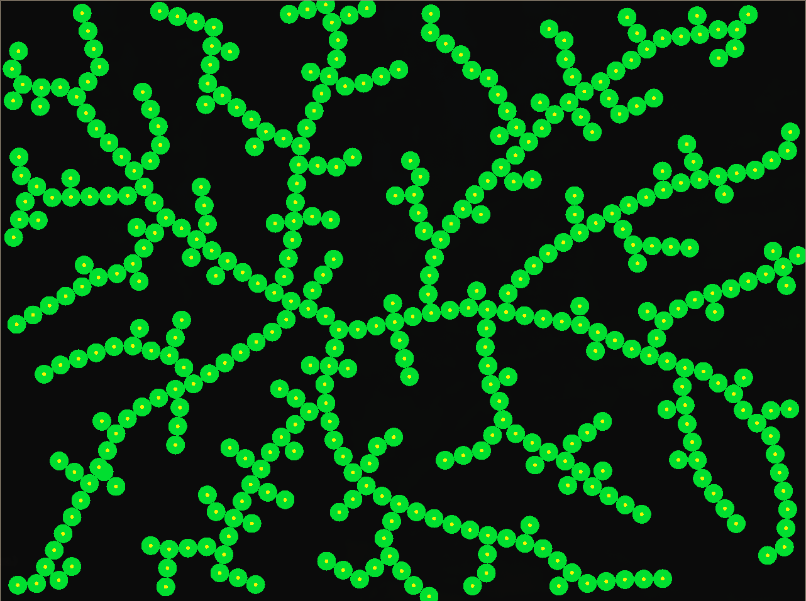

# Implementation of space colonization algorithms for generating structures appearing in nature

It implements a random generation of leaf veins structures (2D) following the [paper](https://dl.acm.org/doi/epdf/10.1145/1073204.1073251)

In future there will be also implementation of generating trees (3D) as presented in [here](https://diglib.eg.org/server/api/core/bitstreams/7514f4d7-4658-46ff-9141-86213b42c235/content)

The projects uses raylib and zig and the idea of implementing such project was heavily inspired while watching this [great video](https://www.youtube.com/watch?v=Gu_L8MPvGJM)

